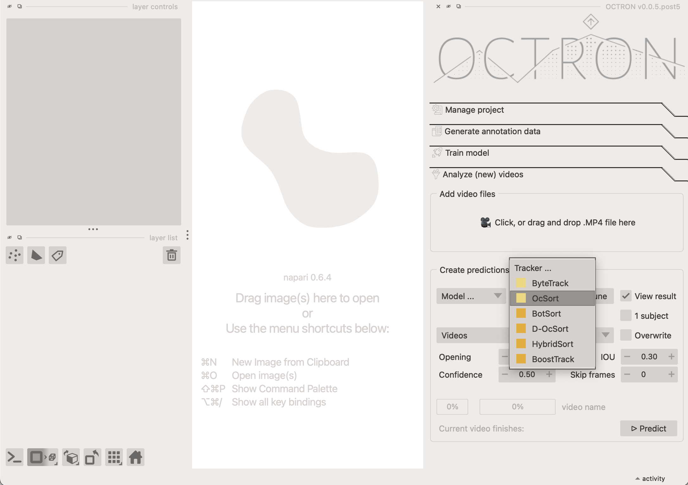

# Analyze (new) videos
Once you have a trained model, you can use it to analyze all your videos. This is done in the **Analyse (new) videos** tab.
We recommend creating short excerpts from your test videos to try out and adjust parameters before running the full-length videos through analysis.
This approach saves time and speeds up testing because you can quickly see how your settings perform without waiting for an entire long video to process.
OCTRON by default only accepts MP4 transcoded videos. You can use OCTRON to transcode a whole folder of videos of any format to .mp4 (check out [Create Project](create-project.md)).

??? note "Extracting a snippet from an existing .mp4 file"
    To extract a snippet from an existing video you can do<br>
    ```
    ffmpeg -ss 20 -i "your_video_path.mp4" -t 60 -c:v libx264 -preset superfast -crf 23 -an "your_video_path_snippet.mp4" 
    ```
    where<br>
    - `-ss` indicates the start of the snippet in seconds from the start of the video.<br>
    - `-t 60` indicates that you want to extract 60 seconds from the video.<br>
    - `-c:v libx264 -preset superfast -crf 23 -an` specifies the codec (**do not change this!**) and that you do not want any audio in the output.<br>




## Add video files
Start by adding the video(s) you want to analyze in the **Add Video Files** section. You can either drag and drop one or more files into this area or click it to open a file selection dialog. Once added, the videos will appear in the Videos dropdown menu. To remove a video, open the dropdown, click Remove, and select the videos you want to delete from the list.

## Create predictions from videos
Next, in the *Create predictions from videos* section you indicate how the videos you selected should be analyzed by considering the following options:

- **Choose model...:** Select the model you want to use from the dropdown menu. You can choose models saved at different stages of training—for example, after a certain number of epochs, or the best or last model. We recommend using `best.pt`, which is automatically selected based on performance across all trained epochs, balancing multiple metrics. Tip: Models are found across any number of subfolders in your project main folder. 
- **Tracker...:** if you have annotated more than one object for a given label (e.g. *artemia 1*, *artemia 2*), a tracker needs to be used to help the model determine which is which across frames. Pick the one you prefer in this drop-down menu. If you only have one object per label, click the **1 subject** option and select the **ByteTrack** tracker from the dropdown. See below for detailed explanation about the available trackers. 

### BoxMOT Trackers 
OCTRON uses the BotMOT library to provide state-of-the-art tracking capabilities. The available trackers are designed for different scenarios and can be grouped into two main categories:

- Motion-Only Trackers (ByteTrack and OcSort - pale yellow in dropdown menu). These trackers rely primarily on predicting where objects will move based on their previous positions and velocities (usually with Kalman filters). They're:
    - Fast and efficient: Less computationally intensive
    - Limited: May struggle when objects look similar or cross paths
- Motion + ReID Trackers (BotSort, D-OcSort, HybridSort, BoostTrack - dark yellow in dropdown menu). These more sophisticated trackers combine motion prediction with ReID (Re-Identification) features:
    - More accurate: They remember how objects look (their visual features)
    - Better at difficult scenarios: Can handle occlusions, similar-looking objects and crossing paths
    - Computationally heavier: Require more processing power due to the additional visual analysis
    - More robust: Less likely to confuse identities when objects interact

For most OCTRON users, ByteTrack offers a good balance of speed and accuracy, while ReID powered methods like HybridSort provide better tracking reliability at the cost of processing speed. If tracking multiple similar-looking objects is critical for your project, the ReID-based trackers are usually worth the extra computation time.

You can fine-tune the selected tracker by clicking on **Tune** next to it. This opens a dialogue in which all options that are available for this tracker can be adjusted. In general this is not necessary, but it allows you to play with the parameters if you think that this might improve your results. For in-depth documentation check the [BoxMot docs](https://deepwiki.com/mikel-brostrom/boxmot/4-tracking-algorithms).

- **View result:** select this option if you want OCTRON to automatically open a new window where you can see the result of the analysis once it is complete.
- **1 subject:** select this if you strictly have only one object per class (label category) in your videos. This ensures that only one object is tracked throughout the whole video. Make sure you select a computationally less heavy tracker, like ByteSort or OcSort at the same time. 
- **Overwrite:** select this option if you've previously analysed the selected video and want to replace that analysis.

- **Opening:** the opening disk radius for morphological opening of predicted mask data. An opening operation, which consists of erosion followed by dilation, helps eliminate small bright artifacts (like 'salt' noise) and bridges narrow dark gaps. This process effectively 'opens' dark spaces between bright regions. Increase this if you have a lot of extraneous, noisy blobs in your masks that you want to eliminate.
- **Confidence:** the confidence threshold that should be used to determine which analysed frames to keep. It ranges from 0 to 1. There will likely be frames where the model is more confident that it has identified the right object than others. If the confidence threshold is set to 0.8 it means the model will only keep frames where it is 80% certain that it has correctly identified a given object.
- **IOU (intersection over union):** this threshold determines how much objects can overlap and still be considered separate objects during detection. It ranges from 0 to 1. If this value is zero, then objects during the segmentation step that have no overlap will be considered to be the same object, i.e. there is only one object.
- **Skip frames**: If set to 0, every frame in the selected video(s) will be analyzed.
If set to 1 or higher, the system will skip frames. For example: 1 → analyze every other frame, 2 → analyze every third frame, and so on. This option is useful for speeding up processing when analyzing every single frame isn’t necessary.

Click **Predict**.

OCTRON will now analyze your video(s) and display the progress. If multiple videos are being analyzed at once, then the first progress bar shows the progress over all video files and the second progress bar shows the progress for the current video. An estimated time to completion for the currently analyzed is also provided.


## Results
If you selected *View results* above, then a new window will open once the analysis is complete where you can evaluate how well the model did frame by frame. A track will appear showing the trajectory of the tracked object, and you can adjust the length and color of this track in the *Layer controls* panel. You can, for example, color the track according to the confidence of the model or the area covered by the mask.

To learn what output OCTRON saves for each analysed video file see the [File System - Analysis](file-system.md#analysis) page.
