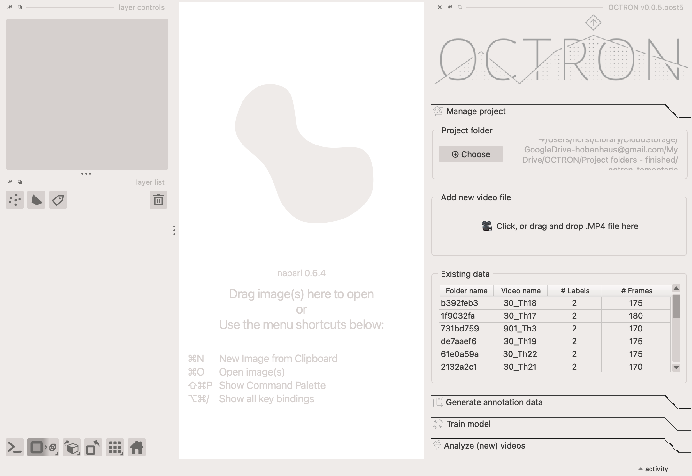

# Generate annotation data
Before you can train your model, you need to tell it what to track. This is done by annotating the videos you’ll use for training in the **Generate Annotation Data** tab. This tab becomes active automatically once a video is loaded and displayed in the center area of napari. If you want to use videos you’ve already annotated, go to the Manage Project tab and double-click the video in the *Existing Data* table to load it.

## Model selection
Select the model you would like to use for your annotations and click *Load model*.

Rule of thumb: the larger the model, the more resources (GPU) it demands. If you can afford it, use the most precise model (`SAM2 Large HQ`), which is however also the most demanding in terms of GPU resources. 

Models in order of resource demands (*SAM2 Base Plus* is the least demanding, *SAM2 Large HQ* the most demanding): 
**SAM2 Base Plus** (original SAM2 model) 
**SAM2 Large** (original SAM2 model)  
**SAM2 Large HQ** (SAM2 HQ model)

## Label manager
This is where you create the labels for the animals/item/structure you want to track. 

1. In the **Type...** drop-down menu, select the type of annotation you would like to use to label your structure. There are two types:

    - **Points:** often the simplest and fastest. The model will automatically label what it thinks you want to track based on what you left-click on and exclude anything you right-click on. The point annotations do not need to be super precise. You can click roughly on what you want to track and add some points around it to exclude neighbouring regions. 
    - **Shapes:** recommended for labelling items that are not so easily created with the 'Points' type. Here you make an outline around the item to show the model what it should label. 

2. In the **Label...** drop-down menu, select *Create* to open a dialogue box where you can name your label and click *Add* to add it. 

    - **Suffix:** *(Optional!)* add a number here if you want to label multiple instances of the same thing (e.g. you have two LEDs and want to label them separately as *LED 1* and *LED 2*). Note that you *can* label multiple instances of the same object in one go on the same layer if they look very similar to each other. If this works for you then you do not need to create multiple layers for the same thing. However, SAM2 models do not always track multiple objects per layer well, making it necessary to create multiple layers for those objects.

        ??? note "Why suffixes are useful"
            When using suffixes for your labels, e.g. *LED 1* and *LED 2*, then these labels will end up in the same class (i.e. *LED*) during training. This means that the model treats these as the same type of object when training to identify them, and therefore has twice as many annotations to train on. In contrast, if you give the two LEDs separate labels (i.e. not using the suffix option) then the model will consider these to be separate types of objects and train on them separately too. **Hot tip**: It is not always necessary to create separate annotations for repeated objects in your scene! SAM does pick up on repeated textures in your frames, so, if you have objects that look very similar, try to use a points layer to annotate them all in one go (on one single layer). 

        ??? note "Removing unwanted label names"
            If you want to remove one of the labels you've created from the *Label ...* drop-down menu, then select *Remove* in the drop-down menu and in the pop-up select the label you want to get rid of. This does **not** remove the annotation / mask layers, if any were created for that label.

3. Click the **Create** button to create your label. Two new layers will appear in the *layer list* (bottom left left hand section of OCTRON, more on that later).

4. Repeat steps 1-3 until you have all the labels you need. **Important**: Make sure you create all your labels and layers before the first batch prediction (see below). Some SAM2 models do not allow you to add new labels once you started predicting. However, if you run into this problem, you can easily *Reset* the model (see notes below).

### Annotation 
In the bottom left section of OCTRON you have a *layer list* of all your layers. When you click on a layer you'll get access to its *layer controls* in the panel directly above. All layers can be toggled visible/invisible by clicking the 👁️ symbol on the respective layer.
Each label you create has two layers that it is associated with:

- A **points** or **shapes** layer (depending on what you selected) – this is where you make your annotations.
- A **masks** layer – this shows the result of your annotations, the region predictions, meaning what the SAM2 model has identified as the object based on your input.

You should never modify the **masks** layer manually. It is simply a visualization layer for the annotated objects. Only work with the **points** or **shapes** layers. 

1. Click on the video layer (the bottom most layer) and make any adjustments necessary (e.g. adjust contrast to enhance visibility of your objects).

2. Navigate to the frame you want to annotate first using the timeline underneath the video. **Important**: Choose episodes in your videos for annotation that are "meaningful". For example, if the animal you are trying to annotate is stationary for the first 500 frames and starts moving on frame 501, it is relatively useless to start annotating on frame 1 of this video since you will accumulate a lot of still frames that do not add much extra information compared to the ones where the animal is actually moving. Rule of thumb: Pick frames that show a wide variety of the subject’s behavior.

3. Add your first annotation. Depending on the layer type you chose:
    - **Points:** click on a points layer and make sure the ➕ symbol is selected in the *layer controls* panel. Use your mouse to left-click on the object you want to track; you should see a semi-translucent mask appear covering that object. Right-click on anything that should *not* be included in that mask. The more clicks you make of both kinds, the more refined the region prediction becomes. The clicks do not have to be very precise. Rule of thumb: 1-5 clicks per object should give you nicely segmented regions. For complex objects with less pronounced separation from background you might need to add more clicks. 

        ??? note "How to edit or remove unwanted points"
            If you make a mistake and would like to edit or remove a point, select the point with the arrow (selection tool) in the *layer controls*. You can either move it with the arrow tool or delete it by clicking on the "x". The region prediction will update automatically.

    - **Shapes:** click on a shapes layer and select the type of shape you want to use in the *layer controls*. Note that the square/rectangle behaviour is different from the other shapes:
        - **Rectangle:** left-click and drag the shape around the object you want to label, and release. OCTRON will automatically try to identify the structure you want to label within that shape. 
        - **Any other shape:** left-click and drag and release (e.g. for the circle shape), or left-click around the shape you want to label (e.g. for the polygon shape). You can refine a shapes layer by using the tools shown in that layer's *layer controls* (e.g. remove/add/adjust points on the shape outline). As with the points layer, the predictions will update automatically after every change.

    Note that every annotation is automatically saved: As soon as a region prediction, i.e. mask is shown to you it is already saved to disk. If you ever want to switch the annotation type (e.g. from *points* to *shapes*), delete the mask layer associated with that annotation type by selecting it and clicking the 🗑️ symbol (both the mask and points layers will be removed), then add the layer again. The annotations you have done up to this point are not deleted though! If you choose the same label name and suffix when re-creating the layer, the previous mask annotation data will be reloaded, and you will be able to continue annotating with the new annotation layer. 

    ??? question "How do I completely delete annotations?"
        It is relatively tough to "destroy" annotations you have created in your project. For example, if you delete the mask or annotation layers you can easily re-create them and the underlying mask information for every annotated frame will be automatically reloaded if it is saved on disk. But lets say you are unhappy with one of your annotations and you want to start from scratch. In this case you need to go through the following steps:
        
            - Delete the corresponding *mask* and *annotation* layers in napari (if you delete the *mask* layer, the *annotation* layer will be auto-deleted).
            - Find the annotation file in your project folder on disk and delete it manually. All annotations are saved per video under a folder with a hash (8 characters consisting of numbers and letters). This hash is also shown in the *Existing data* table in the **Manage project** tab and it is written in the title of the annotation tab (For example: `Generate annotation data for: 52174460`). Once you found this hash subfolder in your project folder, open it. Within, you will find a folder called something like *"your-label-name masks.zarr"*. Remove this folder. 
            - Re-create the layers in your project in OCTRON

4. Once you have annotated all the object you want to track in a single frame, you can now get help from OCTRON to annotate the remaining frames by "batch predicting" subsequent frames in the video without having to manually annotate them. 

## Batch prediction
1. In the *Batch prediction* section, click ▶️ to predict the next frame. The model you selected under *Model selection* will now create masks in the following frame, on what it thinks are the same objects as those you've annotated. 

    ??? note "What to do if the predicted masks look bad"
        If this happens then you need to refine the predicted mask: 

          - If you used the *points* type, then you just need to add a few more left- and right-clicks on the old or the new frame to help the model recognise the object better. 
          - If you used the the *shapes* type it's often easiest to redraw the shape in the new frame. 

If you're happy with the prediction, continue clicking ▶️ to see if the predictions continue to look good for the following frames, adjusting the masks if necessary.

2. Once the predictions seem to be reliably good, click the *15 frames* button to predict 15 frames in a row. Once the predictions are finished, you can go back and adjust the masks if necessary; either individually if there's only one or two frames that are off, or just the first frame where the predictions went wrong and then try predicting 15 frames again from there (the new predictions will overwrite the old ones).

3. (*Optional*) When predicting 15 frames in a row works well, then you can start to **skip frames** to speed up the process, especially if there is very little happening from frame to frame, i.e. the animal is relatively stationary and does not change much from frame to frame. If at some point you need to return to a previously annotated frame that was several frames away, you can use the *timeline control* to quickly move between them.

    - **Skip:** the number of frames you want to skip before predictions should be made again (this will apply both if you click ▶️ and if you click *15 frames*).
    - **Timeline control:** click *Jump to previous* or *Jump to next* to move to the closest preceding/upcoming annotated frame.

4. Continue predicting frames until you reach the end of the video or have annotated a reasonable number of frames. At this point, click on **Visualize all** in Layer Controls to check how well your annotations cover the field of view and the subject’s range of postures. This helps ensure your annotations aren’t concentrated in just one area, unless, of course, the object you’re annotating is stationary. It is usually better to find episodes in your video during which the object of interest moves around and goes through various postures - the more diversity you capture, the better.

    ??? question "How do I know how many frames have been annotated?"
        Open the *Manage project* tab and look for the video you're currently annotating in the *Existing data* list. The last few characters of the folder and file name are visible in the first two columns, followed by the number of labels in each video, and the total number of frames that have been annotated. Each row can be hovered over with your mouse to reveal the full video path and label names.
        
        

    ??? question "How many frames should I annotate?"
        Rule of thumb: Aim for about 100–150 annotations per video. The exact number depends on how much variety your annotations cover. The more diverse they are, the better your model will learn to generalize.
        Focus on clips that show lots of different postures and movements. A stationary object won’t teach the model much.

    ??? note "The predictions become much slower than they were in the beginning"
         Sometimes the batch predictions slow down significantly. This sometimes happens when the model is basing its predictions on a large number of annotated frames and objects. If the model helping you annotate starts to slow down, click the **Reset** button (underneath **Create**). This clears the model’s temporary memory and gives it a fresh start - but don’t worry, your existing annotations and mask layers will stay intact. After resetting, you’ll need to teach the model again from scratch for each object you want to track.

5. Ready to move onto the next video? Delete the video layer (this will remove all the other layers too) and [add a new video file](create-project.md/#add-new-video-file). The *Label...* drop-down menu will remain unchanged, so you save some time when creating labels and can quickly start annotating again.

    !!! warning "Always use the same label names"
        Make sure to be consistent when naming labels across videos (e.g. if you start with 'stone', don't use 'rock' later). If the names are not identical then OCTRON will assume that you're annotating different objects and treat them as such.

    ??? question "Is it better to annotate a lot of frames in a few videos, or a few frames in a lot of videos?"
        You need a reasonable number of annotated frames in each video (see the guideline above), but once you’ve reached that, it’s better to annotate more videos rather than adding more frames to the same video. Why? Because additional videos introduce more diversity and variability into your training data. This helps the model learn to generalize better, resulting in improved performance.

    ??? tip "Re-opening a previously annotated video"
        In the [*Existing data*](create-project.md/#existing-data) section in the **Manage project** tab, you can double-click any of the listed videos to re-open one with all its associated layers and annotations. To revise or add annotations, you will need to load a SAM model again in the *Model selection* section. **Hot tip:** It does not matter which SAM model you load! Any of them work when reloading an annotation project. This way you can mix and exchange models on subsequent runs if you think that it could help to exchange SAM models for your annotation project. 

To understand more about what output OCTRON is saving during annotations see the [File System - Annotation](file-system.md#annotation) page.

## Combining annotation data 

You can easily combine annotation data in OCTRON. For example, if you and your colleagues annotate different videos on separate computers, just copy or move all the annotation folders (the ones with 8 random letters and numbers) into the project folder. Make sure all the raw video files used for those annotations are also available in the project folder path. When you load this combined project folder in OCTRON, all annotations across all videos will appear, and you can create training data as usual (see the next pages). **Important**: Ensure that label names are consistent across all annotations.