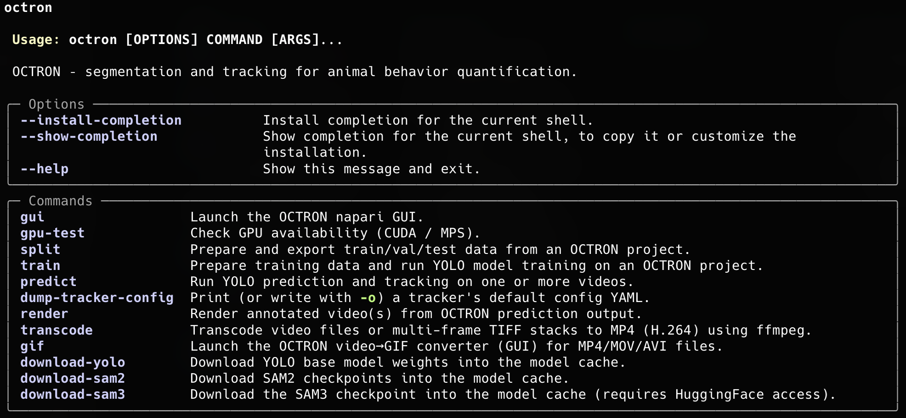

# Using the command line (CLI)
Everything you can do from the GUI for the model pipeline — preparing data, training, prediction and rendering — is also available from a single `octron` command. The CLI is ideal for batch jobs, headless servers, remote machines (SSH) and reproducible scripts.

After installation, `octron` is available in your environment. Running it with no arguments (or with `--help`) prints the help menu with every available command:

<!-- TODO: replace cli_help.png with the screenshot of `octron --help` (drop it in docs/assets/screenshots/). -->


!!! tip "Per-command help"
    Every subcommand documents its own options. Append `--help` to any command to see the full, always up-to-date list, for example:
    ```
    octron predict --help
    ```

!!! note "`octron gui` replaces `octron-gui`"
    `octron` is now the single entry point. Launch the graphical interface with `octron gui` (see [Using the GUI](gui.md)).

## Command overview
The table below lists every command and links to the relevant part of the documentation.

| Command | What it does | Related docs |
| --- | --- | --- |
| `octron gui` | Launch the napari GUI. | [Using the GUI](gui.md) |
| `octron transcode` | Convert videos (or TIFF stacks) to OCTRON-compatible MP4 (H.264). | [Create project](create-project.md) |
| `octron split` | Export train/val/test data from an annotated project. | [Training › Generate training data](training.md#generate-training-data) |
| `octron train` | Prepare data (optional) and train a YOLO model. | [Training › Train](training.md#train) |
| `octron predict` | Run detection/segmentation **and** tracking on one or more videos. | [Analyze (new) videos](analysing.md), [File system › Analysis](file-system.md#analysis) |
| `octron render` | Render annotated overlays or per-animal tracklet crops from predictions. | [File system › Analysis](file-system.md#analysis), [Access output data](access-data.md) |
| `octron dump-tracker-config` | Print/write a tracker's default config YAML to customize it. | [BoxMOT trackers](analysing.md#boxmot-trackers) |
| `octron gpu-test` | Report CUDA / MPS (GPU) availability. | [Installation](installation.md) |
| `octron download-yolo` | Download/refresh YOLO base weights into the model cache. | [Installation](installation.md) |
| `octron download-sam2` | Download/refresh SAM2 checkpoints into the model cache. | [Installation](installation.md) |
| `octron download-sam3` | Download/refresh the SAM3 checkpoint (needs HuggingFace access). | [Installation](installation.md) |
| `octron gif` | Convert MP4/MOV/AVI videos to GIF (opens a small GUI helper). | — |

## Core workflow
These commands mirror the GUI workflow end to end: transcode → (split) → train → predict → render.
### `octron transcode`
Convert videos of any format — or multi-frame TIFF stacks — into the MP4 (H.264) format OCTRON expects. This is the command-line equivalent of the transcoding step described in [Create project](create-project.md).
```
octron transcode /path/to/videos -o /path/to/videos/mp4_transcoded
```

| Option | Default | Description |
| --- | --- | --- |
| `VIDEOS...` | *(required)* | One or more video/TIFF files, or a directory containing them. |
| `--output`, `-o` | `mp4_transcoded/` next to input | Output directory. |
| `--crf` | `23` | Constant Rate Factor (0–51); lower = better quality. |
| `--fps` | source | Output framerate (TIFF stacks default to 20). |
| `--no-audio` | off | Drop the audio track instead of re-encoding to AAC. |
| `--overwrite` | off | Overwrite existing output files. |

### `octron split`
Prepare and export the train/val/test split from an annotated OCTRON project, without training. Useful if you want to inspect the split first, then run `octron train --no-split`. See [Training › Generate training data](training.md#generate-training-data).
```
octron split /path/to/project --train 0.7 --val 0.15 --dry-run
```

| Option | Default | Description |
| --- | --- | --- |
| `PROJECT_PATH` | *(required)* | Path to the OCTRON project directory. |
| `--mode` | `segment` | `segment` (instance segmentation) or `detect` (bounding boxes). |
| `--train` | `0.7` | Fraction of frames used for training. |
| `--val` | `0.15` | Fraction for validation (the remainder becomes the test split). |
| `--seed` | `88` | Random seed for a reproducible split. |
| `--dry-run` | off | Print the split sizes without writing any files. |

### `octron train`
Prepare training data (by default) and train a YOLO model. This is the command-line equivalent of [Training › Train](training.md#train).
```
octron train /path/to/project --model yolo26m --mode segment --epochs 250 --device auto
```

| Option | Default | Description |
| --- | --- | --- |
| `PROJECT_PATH` | *(required)* | Path to the OCTRON project directory. |
| `--model` | `yolo26m` | YOLO base model to train. |
| `--mode` | `segment` | `segment` or `detect`. |
| `--device` | `auto` | `auto`, `cpu`, `cuda`, or `mps` (`auto` picks CUDA → MPS → CPU). |
| `--epochs` | `250` | Number of training epochs. |
| `--imagesz` | `640` | Input image size. |
| `--save-period` | `50` | Save a checkpoint every N epochs. |
| `--overwrite` | off | Overwrite an existing trained model (default: skip if `best.pt` exists). |
| `--resume` | off | Resume from an existing `last.pt` checkpoint. |
| `--no-split` | off | Skip data preparation (use when `octron split` has already run). |
| `--train` / `--val` / `--seed` | `0.7` / `0.15` / `88` | Split fractions and seed (ignored with `--no-split`). |

### `octron predict`
Run a trained model on new videos to produce detections/masks and tracks. This is the command-line equivalent of [Analyze (new) videos](analysing.md); the output layout is documented under [File system › Analysis](file-system.md#analysis).
```
octron predict clip1.mp4 clip2.mp4 --model /path/to/best.pt --tracker bytetrack --device auto
```

| Option | Default | Description |
| --- | --- | --- |
| `VIDEOS...` | *(required)* | One or more video files, or a directory of `.mp4` files. |
| `--model` | *(required)* | Path to a trained YOLO `.pt` file (or a run directory containing `best.pt`). |
| `--tracker` | `bytetrack` | Tracker algorithm — see [BoxMOT trackers](analysing.md#boxmot-trackers). |
| `--tracker-config` | – | Custom tracker YAML, overrides `--tracker` (create one with [`octron dump-tracker-config`](#octron-dump-tracker-config)). |
| `--device` | `auto` | `auto`, `cpu`, `cuda`, or `mps`. |
| `--conf-thresh` | `0.5` | Detection confidence threshold. |
| `--iou-thresh` | `0.7` | IoU threshold for non-maximum suppression. |
| `--skip-frames` | `0` | Skip frames between predictions (0 = analyze every frame). |
| `--one-object-per-label` | off | Track only the top-confidence detection per label. |
| `--opening-radius` | `0` | Morphological opening radius applied to masks (0 = off). |
| `--detailed` | – | Region properties to extract — a comma-separated list or `all` (see [.csv data](file-system.md#analysis)). |
| `--overwrite` | off | Replace existing predictions (default: skip already-analysed videos). |
| `--buffer-size` | `500` | Frames buffered before writing to zarr. |
| `--output-dir`, `-o` | alongside each video | Directory where `octron_predictions/` is written. |
| `--local-cache-dir` | from `config.yaml` | Stage output on a fast local disk, then move each finished video to `--output-dir`. |

### `octron render`
Turn prediction output into shareable videos: an annotated overlay (masks/boxes/labels) or one stabilised crop video per tracked animal (tracklets). See [File system › Analysis](file-system.md#analysis) and [Access output data](access-data.md).
```
# Annotated overlay
octron render /path/to/octron_predictions/clip1_bytetrack --preset draft

# One cropped, stabilised video per animal
octron render /path/to/octron_predictions/clip1_bytetrack --tracklets --skip-empty
```

| Option | Default | Description |
| --- | --- | --- |
| `PREDICTIONS_PATH` | *(required)* | A prediction output directory (`octron_predictions/<video>_<tracker>/`). |
| `--video` | auto | Original video; auto-detected if alongside `octron_predictions/`. |
| `--output`, `-o` | `<predictions>/rendered/` | Output directory. |
| `--preset` | `draft` | `preview` (0.25×), `draft` (0.5×), or `final` (full resolution). |
| `--start` / `--end` | full video | First / last frame to render. |
| `--alpha` | `0.4` | Mask overlay opacity (0–1). |
| `--masks` / `--no-masks` | mode-dependent | Draw segmentation masks. |
| `--boxes` / `--no-boxes` | mode-dependent | Draw bounding boxes. |
| `--labels` / `--no-labels` | on | Draw label text (overlay only). |
| `--min-confidence` | `0.5` | Skip detections below this confidence. |
| `--min-observations` | `0` | Skip tracks with fewer than N observations. |
| `--track-ids` | all | Comma-separated track IDs to render (e.g. `1,3,5`). |
| `--skip-empty` | off | Drop frames with no detection (handy for `--skip-frames` output). |
| `--trim` | off | Trim each video to the track's first/last observation. |
| `--bbox-sizes` | off | Report per-track bounding-box sizes (to pick `--tracklet-size`), then exit. |
| `--debug` | off | Verbose logging with per-stage timing. |

When `--tracklets` is set, these additional options apply:

| Option | Default | Description |
| --- | --- | --- |
| `--tracklets` | off | Render one stabilised crop video per tracked animal. |
| `--tracklet-size` | `auto` | Crop side length in px (`auto` = largest bbox + padding). |
| `--tracklet-smooth-sigma` | `2.0` | Gaussian centroid smoothing in frames (0 = off). |
| `--tracklet-interpolate` | `0` | Bridge gaps up to N consecutive missing frames. |
| `--tracklet-segment-only` | off | Black out all pixels outside each animal's mask. |
| `--tracklet-segment-keep` | `0` | Keep only the N largest mask components (0 = keep all). |
| `--tracklet-offset` | `0,0` | Shift the crop centre by `DX,DY` (source-video pixels). |

## Trackers
### `octron dump-tracker-config`
Print a tracker's default configuration as YAML (or write it to a file with `-o`). Edit the file and pass it to `octron predict --tracker-config <file>` to fine-tune tracking — the command-line equivalent of the **Tune** dialog described under [BoxMOT trackers](analysing.md#boxmot-trackers).
```
octron dump-tracker-config bytetrack -o my_tracker.yaml
```

| Option | Default | Description |
| --- | --- | --- |
| `TRACKER` | `bytetrack` | Tracker whose default config to dump. |
| `--output`, `-o` | stdout | Write to this file instead of printing. |

## Setup & utilities
### `octron gui`
Launch the OCTRON napari GUI. See [Using the GUI](gui.md). No options.
```
octron gui
```

### `octron gpu-test`
Report whether a CUDA or MPS (Apple Silicon) GPU is available — useful to confirm your install can use hardware acceleration (see [Installation](installation.md)). No options.
```
octron gpu-test
```

### `octron download-yolo` / `download-sam2` / `download-sam3`
Pre-download model weights and checkpoints into the per-user model cache, so the first GUI/prediction run does not have to. SAM3 requires HuggingFace access (see [Installation](installation.md)).
```
octron download-yolo
octron download-sam2
octron download-sam3
```

| Option | Default | Description |
| --- | --- | --- |
| `--force` | off | Re-download even if the files already exist. |

### `octron gif`
Open a small GUI helper that converts MP4/MOV/AVI videos to animated GIFs (handy for figures and slides). No options.
```
octron gif
```
