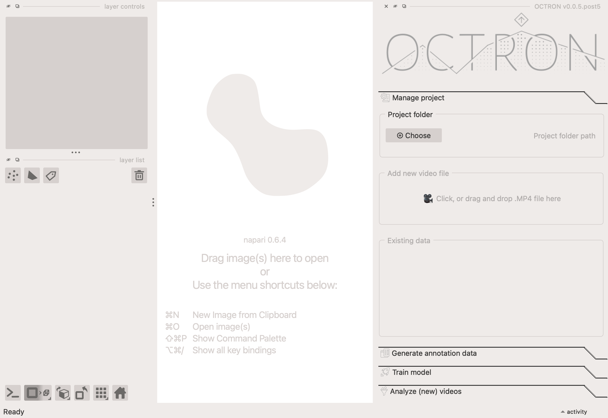

# Using the GUI
To open OCTRON together with napari, first conda activate your newly created environment. 

```sh
conda activate octron
```
Then you can use this command to open napari and OCTRON in the same go (i.e. napari will load and open OCTRON as plugin on the right side of the app).
```sh
octron-gui
```

... and enjoy! 
On first start this will take a long time to load, since all available models are downloaded. Subsequent startups will be much quicker. 

## The four main panels

- **Main OCTRON GUI** (right): this is where you navigate through the different steps of the process, from [opening your project](create-project.md) (*Manage project* tab), [annotate videos](annotating.md) (*Generate annotation data* tab), [train a model](training.md) on your annotated videos (*Train model* tab), and use your trained model to [analyze new videos](analysing.md) (*Analyze (new) videos* tab).
- **Video panel** (center): That is the center region of napari - videos you are annotating will show up here.
- **Layer list** (left bottom): the annotations you create will be shown as individual layers in this section.
- **Layer controls** (left top): the tools to create annotations will be found here once you've selected a specific layer in the *Layer list*.

!!! important "Drag and drop functionality"
    OCTRON disables the drag-and-drop functionality for single files in napari. This is to prevent users from circumventing the project management of OCTRON itself. However, there are two exceptions for *folders* (not single files): 
    OCTRON prediction output folders can be dropped on the main window and are opened to display the results in napari, and folders containing (any kind of) video file can be drag-and-dropped to open a video transcoding sub-GUI. Read on to learn more on the following pages.

