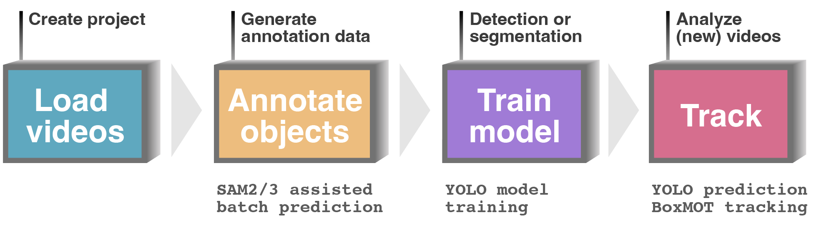

**OCTRON** is a pipeline built on [napari](https://www.napari.org) that enables segmentation and tracking of animals in behavioral setups. It helps you to create rich annotation data that can be used to train your own machine learning segmentation models. This enables dense quantification of animal behavior across a wide range of species and video recording conditions. 

OCTRON is built on [Napari](https://www.napari.org), [Segment Anything (SAM2)](https://segment-anything.com/), [YOLO](https://www.ultralytics.com/), [BoxMOT](https://github.com/mikel-brostrom/boxmot) and 💜.

Main repository: [OCTRON-GUI](https://github.com/OCTRON-tracking/OCTRON-GUI)

The main steps implemented in OCTRON typically include: Loading video data from behavioral experiments, annotating frames to create training data for segmentation, training machine learning models for segmentation and tracking, and finally applying models to new data for automated tracking.
<br>
<br>

<br>
<video width="100%" muted controls poster="assets/videos/poster_frame.jpg" style="display: block; margin-left: auto; margin-right: auto;">
  <source src="assets/videos/MAIN.mp4" type="video/mp4">
  Your browser does not support the video tag.
</video>

!!! info "Support" 
    If you find this project helpful, consider supporting us:<br>
    - [GitHub Sponsors](https://github.com/sponsors/OCTRON-tracking)<br>
    - [Buy Me a Coffee](https://buymeacoffee.com/octron)


!!! quote "How to cite"
    Using OCTRON for your project? Please cite this paper to share the word! 
    <br>
    Jacobsen, R. I., van Eekelen, N. M., Humphrey, L., Renton, J., van Rooij, E., Rivera, J., Arenas, O. M., Lumpkin, E. A., Maccuro, S., Buresch, K. C., Seuntjens, E., & Obenhaus, H. A. (2025). OCTRON - a general purpose segmentation and tracking pipeline for behavioral experiments. *bioRxiv*, 2025.12.20.695663. [https://doi.org/10.64898/2025.12.20.695663](https://doi.org/10.64898/2025.12.20.695663)
    ```{bibtex}
    @ARTICLE{Jacobsen2025-qq,
      title    = "{OCTRON} - a general purpose segmentation and tracking pipeline
                  for behavioral experiments",
      author   = "Jacobsen, Ragnhild Irene and van Eekelen, Nadia M and Humphrey,
                  Laurel and Renton, Johnston and van Rooij, Elke and Rivera, Jason
                  and Arenas, Oscar M and Lumpkin, Ellen A and Maccuro, Sofia and
                  Buresch, Kendra C and Seuntjens, Eve and Obenhaus, Horst A",
      journal  = "bioRxiv",
      pages    = "2025.12.20.695663",
      abstract = "OCTRON is a pipeline for markerless segmentation and tracking of
                  animals in behavioral experiments. By combining Segment Anything
                  Models (SAM 2) for rapid annotation, YOLO11 models for training,
                  and state-of-the-art multi-object trackers, OCTRON enables
                  unsupervised segmentation and tracking of multiple animals with
                  complex, deformable body plans. We validate its versatility across
                  species - from transparent marine annelids to camouflaging
                  cuttlefish - demonstrating robust, general-purpose applicability
                  for behavioral analysis.",
      month    =  dec,
      year     =  2025,
      language = "en"
    }
    ```
<br>
<hr>

!!! info "Attributions"
    - Interface button and icon images were created by user [Arkinasi](https://thenounproject.com/browse/collection-icon/marketing-agency-239829/) from Noun Project (CC BY 3.0)
    - Logo font: [datalegreya](https://datalegreya.figs-lab.com/?lang=en)
    - OCTRON mp4 video reading is based on [napari-pyav](https://github.com/danionella/napari-pyav)
    - OCTRON training is accomplished via ultralytics: 
    ```{bibtex}
    @software{yolo11_ultralytics,
      author = {Glenn Jocher and Jing Qiu},
      title = {Ultralytics YOLO11},
      version = {11.0.0},
      year = {2024},
      url = {https://github.com/ultralytics/ultralytics},
      orcid = {0000-0001-5950-6979, 0000-0002-7603-6750, 0000-0003-3783-7069},
      license = {AGPL-3.0}
    }
    ```
    - OCTRON annotation data is generated via Segment Anything:
    ```{bibtex}
    @article{kirillov2023segany,
      title={Segment Anything},
      author={Kirillov, Alexander and Mintun, Eric and Ravi, Nikhila and Mao, Hanzi and Rolland, Chloe and Gustafson, Laura and Xiao, Tete and Whitehead, Spencer and Berg, Alexander C. and Lo, Wan-Yen and Doll{\'a}r, Piotr and Girshick, Ross},
      journal={arXiv:2304.02643},
      year={2023}
    }
    ```
    ```{bibtex}
    @inproceedings{sam_hq,
        title={Segment Anything in High Quality},
        author={Ke, Lei and Ye, Mingqiao and Danelljan, Martin and Liu, Yifan and Tai, Yu-Wing and Tang, Chi-Keung and Yu, Fisher},
        booktitle={NeurIPS},
        year={2023}
    }  
    ```
     - OCTRON multi-object tracking is achieved via BoxMot trackers:
    ```yaml
    cff-version: 15.0.2
    preferred-citation:
      type: software
      authors:
        - family-names: Broström
          given-names: Mikel
      title: "BoxMOT: pluggable SOTA tracking modules..."
      version: 15.0.2
    ```
   


<br>
<br>
