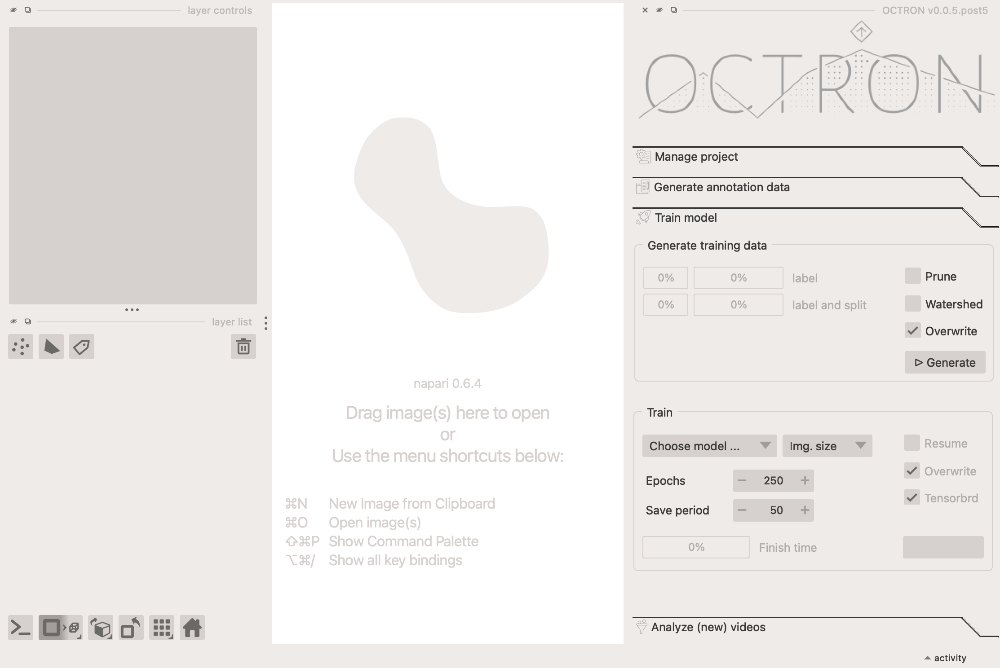

# Training

Once you have a decent number of annotated frames, you are ready to train your model. This is done in the **Train model** tab.



## Segmentation vs. Detection 

OCTRON supports two types of models for tracking animals: **segmentation models** <span style="display: inline-block; width: 12px; height: 12px; background-color: #7e56c2; margin: 0 4px; vertical-align: middle; border-radius: 2px;"></span> and **detection models** <span style="display: inline-block; width: 12px; height: 12px; background-color: #5f9bdb; margin: 0 4px; vertical-align: middle; border-radius: 2px;"></span>. Segmentation models provide pixel-level masks that outline the exact shape of each detected object, while detection models provide only bounding boxes. Both use the same annotation data, so you can train either type from your annotated frames. 
Segmentation and detection are color coded throughout the GUI.


|                  | Detection <span style="display: inline-block; width: 12px; height: 12px; background-color: #5f9bdb; margin: 0 4px; vertical-align: middle; border-radius: 2px;"></span>                          | Segmentation <span style="display: inline-block; width: 12px; height: 12px; background-color: #7e56c2; margin: 0 4px; vertical-align: middle; border-radius: 2px;"></span>                                              |
| ------------------------ | ----------------------------------------------------- | ------------------------------------------------------------------------- |
| **Output detail**        | Boxes around objects | Precise outlines + boxes around objects                                                 |
| **Annotation effort**    | Same (OCTRON derives bboxes from masks automatically). *You can use the same dataset for both detection as well as segmentation training!* | Same (masks are the native format). *You can use the same dataset for both detection as well as segmentation training!*                                    |
| **Training speed**       | Faster | Slower                             |
| **Inference speed**      | Faster (predictions are quick) | Slower (more detail to compute)                                  |
| **Model size**           | Smaller (faster to load) | Larger (takes up more disk space)                                         |
| **Result disk space**    | Very efficient (minimal storage in .csv files) | Creates .csv files as for detection, but also zarr arrays for mask data                                    |
| **Spatial precision**    | Less precise (bounding boxes only) | More precise (exact object outlines)                                             |
| **Downstream analysis**  | Limited measurements (position, size, shape) | Extensive measurements (shape properties, texture, intensity, and more) |
| **Tracking robustness**  | Reliable (same as for segmentation because bounding boxes are used) | Reliable (bounding boxes are used)

!!! info "RT-DETR: a detection-only model family"
    Besides YOLO, OCTRON can also train **RT-DETR** models — a transformer-based, **detection-only** family. Because they produce bounding boxes (no masks), they appear in the model dropdown **only when Detection is selected**. RT-DETR is end-to-end and **NMS-free** (there is no IoU/NMS threshold to tune) and uses transformer *global context* that can help in cluttered scenes or when animals overlap, while still running in real time. The trade-offs: no segmentation masks, and it is more data- and memory-hungry than YOLO, so it benefits from a larger annotated dataset. See [Which model should I choose?](#train) for the available variants.


## Generate training data
OCTRON needs to generate data to train the model on: it takes your annotations and splits them into a **training**, **validation**, and **test** set. The validation set lets OCTRON track how well training is going on held-out frames, and the test set is kept aside for a final, unbiased check. First, consider these options:

- **Prune:** select this if there are frames in which it is likely that not all of your objects were annotated despite them all being present. By selecting this option OCTRON will 'prune' the annotated frames so that only those where all labels are present are used. Otherwise you will be counteracting the training (the model will think that if one object isn't annotated in a certain frame, but the other objects are, this means the un-annotated object isn't there).
- **Watershed:** If you have labeled multiple instances of the *same kind of object* on *the same* annotation layer, then you can use a watershedding operation to make sure that when two or more of these objects touch slightly (for example when they bump into each other over time), they still form separate masks. You can see a visual explanation of this process [here](https://github.com/horsto/OCTRON-GUI/issues/1).
- **Overwrite:** if you've generated a training dataset before, selecting this option will overwrite the existing one (recommended).

Once you click *Generate*, you can observe the progress in the two progress bars:

- **label:** the progress for a given label.
- **label and split:** the progress of exporting the annotated data into the train/val/test sets.

### How the split works
OCTRON annotations often contain long runs of near-identical frames, because SAM propagates a mask you draw across many neighbouring frames. A naive random split would scatter these near-duplicates across train and validation, so the model would effectively be validated on frames it already trained on — and your metrics would look better than they really are.

To avoid this, OCTRON splits **by episode, then by contiguous block**: annotated frames are grouped into *episodes* (bursts of annotation separated by long gaps), each episode is cut into short contiguous chunks, and whole chunks are assigned to train/val/test. Neighbouring near-duplicate frames therefore stay on the same side, and a small buffer frame is dropped wherever a train chunk meets a val/test chunk. The amounts are chosen across the whole video, so the realized proportions track your target (e.g. 70/15/15).

When a project has several labels, the split is decided **once per frame** over all labels together, so a frame annotated for more than one object always lands in the same set — the same image is never used for training on one label and validation on another. The width of the boundary buffer is adjustable, so you can leave a larger temporal gap between train and val/test when your frames are very densely annotated.

### Reading the split summary
After splitting, OCTRON prints a summary table and a colored timeline to the terminal — both in the GUI and via [`octron split`](cli.md#octron-split):
```
Split summary  (seed=88)
----------------------------------------------
Subfolder  Label        Train  Val  Test  Total
----------------------------------------------
43aace64   grey ovals     246   58    59    372
----------------------------------------------

Timeline: 43aace64  (10490 frames, 363 assigned, 9 buffered, 4 episode(s))
0 ██████ … ████ … ██ 10490
Legend: █ train  █ val  █ test  ░ unannotated  … gap
```

- The **summary table** lists, per subfolder and label, how many frames are in Train / Val / Test and the Total. `Total` is often a little larger than Train+Val+Test: the difference is the *buffered* frames dropped at chunk boundaries.
- The **timeline** shows where annotations fall across the whole video. Colored blocks mark train (green), val (blue) and test (yellow); long unannotated stretches are collapsed to ` … `. Each annotated episode is sized in proportion to its frame count, so you can see at a glance how train/val/test are distributed.

!!! tip "Changing the split fractions"
    The GUI uses the split fractions, random seed and boundary buffer stored in your `config.yaml` (defaults: 70% train, 15% validation, 15% test, seed 88, buffer 1). Edit `split_train_fraction`, `split_val_fraction`, `split_seed` and `split_buffer` there to change the split the GUI produces. From the command line you can additionally override them per run with `octron split --train ... --val ... --seed ... --buffer ...` (see [`octron split`](cli.md#octron-split)).

## Train
Once the training data has been generated, OCTRON is ready to train your model.

- **Choose model:** choose which model to use.

    !!! question "Which model should I choose?"
        The larger the model, the more accurate it may be, but the more time and GPU resources it needs too. Recommendation: start with the smallest model and move up from there if necessary. The large model also usually needs more training data.<br>
        
        **YOLO11 Models** (General purpose, good balance of speed and accuracy):
    
        - **YOLO11m:** medium model – improved accuracy, moderate resource usage
        - **YOLO11l:** large model – high accuracy, requires more GPU memory and training time

        **YOLO26 Models** (Latest generation, optimized for edge deployment and small object detection):

        - **YOLO26m:** medium model – improved accuracy over YOLO11, smaller than YOLO11l
        - **YOLO26l:** large model – state-of-the-art accuracy

        **RT-DETR Models** (Transformer-based, **detection-only** – shown only when *Detection* is selected):

        - **RT-DETR-l:** large real-time detection transformer
        - **RT-DETR-x:** extra-large variant – highest accuracy, most resource-intensive

        *Advantages:* end-to-end and **NMS-free** (no IoU/NMS threshold to tune), with transformer global context that helps in cluttered or overlapping scenes, at real-time speed. *Costs:* detection-only (no masks) and more data- and memory-hungry than YOLO, so they benefit from larger annotated datasets. Choose RT-DETR when you only need boxes and expect crowded scenes; choose YOLO when you also want masks or have a smaller dataset.


- **Img. size:** choose which image size OCTRON should train on. If your input videos have a high native resolution (for example 1920x1080 pixels), then training OCTRON with an image size of 1024 makes sense to get higher resolution out of your predictions. This especially helps with smaller labeled structures that cover only a minute fraction of your field of view. However, if your input videos have smaller resolution (for example 640x480 or smaller), then training the model atr 1024 image size makes little sense and might even make training worse. You can type in your own image size here and click enter if you want something else than appears in the dropdown.

- **Epochs:** decide how many epochs the model should train for. The higher the number, the longer the training will take, but if no significant improvement is detected across 100 epochs then the training will automatically stop.

- **Save period:** decide how often (in number of epochs) to save the training results.

- **Resume:** if you've previously started training a model but had to abort for some reason, you can continue from where the training stopped by selecting this option 
- **Overwrite:** if you've previously trained a model and want to replace it, select this option.
- **MLflow:** *(selected by default)* select this to follow the training progress live in your browser via [MLflow](https://mlflow.org/) — a fully local experiment tracker (no account or internet required). When enabled, OCTRON starts a local MLflow UI and opens it in your browser once training begins. Metrics are logged to an `mlflow` folder inside your project's `model` folder, so you can also open the dashboard any time from a terminal: `conda activate` your OCTRON environment and run `mlflow ui --backend-store-uri "YOUR_MODEL_FOLDER/mlflow"`, then click the printed `http://127.0.0.1:5000` link.

When you're happy with your training settings, click *Train*.


## Check training progress and results
**While the model is training** you can track its progress in the terminal window (and with live metric curves in your browser if you selected the *MLflow* option). Once OCTRON has finished one epoch, it will provide an estimate of how long the total training will take, based on how long the first epoch took to complete and how many epochs you've told it to train for. 

**Once the training has finished**, you can check how it went by opening the *model* folder in your project folder, and then the *training* folder. Key files within this folder:

- **results.png:** this image provides an overview of the training progress. If the training went well, then all the curves should have an asymptote. All metrics have their usefulness in those plots, but if you want a quick impression, look at the `mAP` (mean average precision). It measures how effectively a model identifies and localizes objects across various classes and confidence thresholds. mAP is computed by averaging precision across different recall values for each class, typically at specific Intersection over Union (IoU) thresholds—like 0.5 (mAP@0.5) or a range from 0.5 to 0.95 (mAP@0.5:0.95). A higher mAP score indicates that the model is both accurate in classification and precise in object localization.

- **confusion_matrix.png** this shows the confusion matrix, i.e. how "true" classes compare to "predicted" ones across (unseen) test images. If the diagonal is the strongest, that means that most label classes have been successfully predicted. Off-diagonal squares indicate that the model is confusing label identities. You want most of your values to be concentrated on the diagonal. 

- **val_batchX_pred.jpg:** this image shows example frames that were predicted by the model, with the labels and confidence level associated with each label. If the training went well, then the values should be closer to 1 than to 0.

To learn more about the output OCTRON is saving during training see the [File System - Training](file-system.md#training) page.